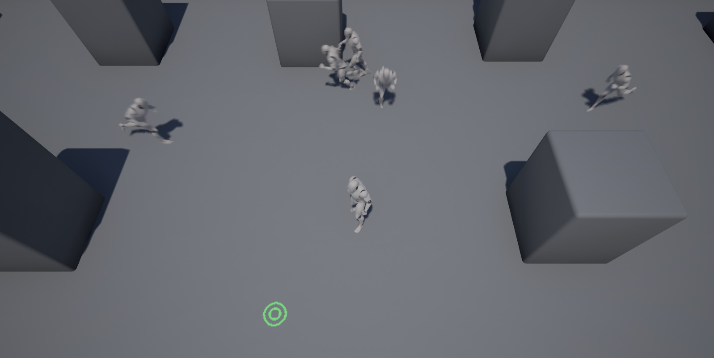

# RPG demo (SpatialOS)

*****

Copyright Improbable 2017

* Link to docs: [SpatialOS Unreal Engine 4 integration documentation](https://spatialos.improbable.io/docs/reference/latest/experimental/unreal/introduction)
* GitHub repository: [https://github.com/spatialos/HelloWorld/](https://github.com/spatialos/HelloWorld/)

*****

### Introduction

This repository contains the SpatialOS project "RPG demo" built with the [Unreal Engine 4](https://www.unrealengine.com/) integration for [SpatialOS](http://www.spatialos.com).
It's an example of a [SpatialOS](http://www.spatialos.com) project that uses [Unreal Engine 4](https://www.unrealengine.com/) as a worker.

For instructions on how to get started with the RPG demo, and general information on using SpatialOS with Unreal, see 
the [SpatialOS Unreal intgration documentation](https://spatialos.improbable.io/docs/reference/latest/experimental/unreal/setup-example-projects).

The main documentation for [SpatialOS](http://www.spatialos.com) can be found [here](https://spatialos.improbable.io/docs/reference/latest/).

#### To use the repository

For detailed instructions on how to build and run this demo, see the [Setting up the example projects](https://spatialos.improbable.io/docs/reference/latest/experimental/unreal/setup-example-projects)
page in the SpatialOS documentation.
